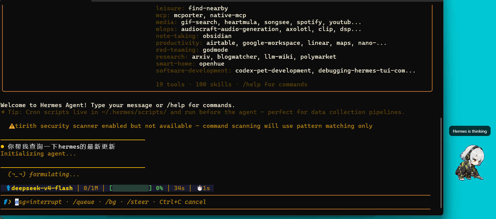

# UniPet

UniPet 是一款面向 AI 编程助手的通用桌面宠物。灵感来源于 Codex Pet，
它是一个轻量级、跨平台的 Node.js + Electron 悬浮窗，在本地运行并
提供简单的 localhost 桥接服务，让 Hermes、OpenClaw、DeepSeek-TUI、
shell 脚本或你自己的 AI agent 都能驱动宠物状态，无需修改它们的内核代码。



## 功能

- 显示一个透明、始终置顶的桌面宠物
- 使用 Codex Pet 语义状态：`idle`、`running`、`waiting`、`failed`、`review`
- 显示 agent 事件的简短气泡消息
- 支持鼠标悬浮 / 点击跳跃动画，可拖拽移动
- 安装、列出、切换、删除本地宠物
- 从宠物市场下载 Codex 兼容的宠物
- 通过可选的零侵入连接器集成 Hermes、OpenClaw 和 DeepSeek-TUI

UniPet 本身不需要 Python。Hermes 连接器里有一个微小的 Python 插件，
仅仅是因为 Hermes 在自己的 Python 环境中加载插件；该插件只用了 Python
标准库模块。

## 环境要求

- Node.js 18+
- npm
- 能运行 Electron 的桌面环境

平台说明：

- Windows 是主要测试平台
- macOS 和 Linux 使用相同的 Node.js/Electron 运行时和 `install.sh`
- WSL 需要 WSLg 或其他可用的 Linux GUI 显示
- Hermes Agent、OpenClaw 和 DeepSeek-TUI 是可选的。仅当需要自动生命周期集成时才安装

## 安装

大多数用户从 npm 安装：

```bash
npm install -g uni-pet
unipet start
```

连接你使用的 agent：

```bash
unipet setup hermes
unipet setup openclaw
unipet setup deepseek-tui
```

后续更新：

```bash
npm update -g uni-pet
```

从 GitHub 源码安装主要用于开发或尝鲜未发布的改动。

Windows PowerShell：

```powershell
git clone https://github.com/ydyangdan/UniPet.git
cd UniPet
powershell -ExecutionPolicy Bypass -File .\install.ps1
```

Unix、macOS、Linux 或 WSL：

```bash
git clone https://github.com/ydyangdan/UniPet.git
cd UniPet
./install.sh
```

源码安装脚本会执行 `npm install`、link 全局 `unipet` 命令、
默认安装 Hermes 连接器、启动 UniPet 并输出 `unipet doctor`。

如果只需要桌面宠物运行时，不需要 Hermes 相关文件：

```powershell
.\install.ps1 -NoHermesSkill
```

```bash
./install.sh --no-hermes-skill
```

如果 Unix clone 后丢失了可执行权限，运行：

```bash
chmod +x ./install.sh ./connectors/hermes/install.sh ./connectors/openclaw/install.sh ./connectors/deepseek-tui/install.sh
```

## 日常使用

启动、查看和停止 UniPet：

```bash
unipet start
unipet status
unipet doctor
unipet stop
```

手动发送测试事件：

```bash
unipet emit running "Hermes 工作中" --source hermes --label Hermes --ttl-ms 120000
unipet emit review "请检查结果" --source hermes --label Hermes --ttl-ms 300000
unipet clear
```

本地桥监听地址：

```text
HTTP  http://127.0.0.1:8768
WS    ws://127.0.0.1:8769/ws
```

## 宠物市场

浏览和安装在线宠物：

```bash
unipet market list
unipet market search cat
unipet market info anby
unipet market install anby --use
```

管理本地宠物：

```bash
unipet pet list
unipet pet current
unipet pet use anby
unipet pet remove anby
```

已安装的宠物和用户配置存放在 `~/.unipet` 下。

## Hermes 集成

npm 安装的用户：

```bash
unipet setup hermes
```

源码安装时，顶层安装脚本默认自动安装 Hermes 连接器，
除非传入 `-NoHermesSkill` 或 `--no-hermes-skill`。

单独安装 Hermes 连接器：

```powershell
.\connectors\hermes\install.ps1
```

```bash
./connectors/hermes/install.sh
```

安装脚本会复制到：

```text
$HERMES_HOME/plugins/unipet
$HERMES_HOME/skills/unipet
```

如果 `hermes` 命令可用，还会自动执行：

```bash
hermes plugins enable unipet
```

启用插件后需要开启新的 Hermes 会话，Hermes 按会话加载 hooks。

## OpenClaw 集成

OpenClaw 支持是可选的，使用原生 hook 插件实现。不修改 OpenClaw 源代码，
也没有 npm 运行时依赖。

npm 安装的用户：

```bash
unipet setup openclaw
```

源码安装时同时安装 UniPet 和 OpenClaw 插件：

```powershell
.\install.ps1 -OpenClawPlugin
```

```bash
./install.sh --openclaw-plugin
```

单独安装 OpenClaw 插件：

```powershell
.\connectors\openclaw\install.ps1
```

```bash
./connectors/openclaw/install.sh
```

启用插件后需重启 OpenClaw Gateway，以便加载启动 hooks。

## DeepSeek-TUI 集成

DeepSeek-TUI 支持是可选的，使用 `~/.deepseek/config.toml` 中的官方生命周期
hooks 实现。不修改 DeepSeek-TUI 源代码。

npm 安装的用户：

```bash
unipet setup deepseek-tui
```

单独安装 DeepSeek-TUI 连接器：

```powershell
.\connectors\deepseek-tui\install.ps1
```

```bash
./connectors/deepseek-tui/install.sh
```

安装后需重启 DeepSeek-TUI，以便加载 hooks。

## 项目结构

```text
UniPet/
|-- overlay/                         Node.js/Electron 桌面运行时
|   |-- main.js                      Electron 应用 + 本地 HTTP/WS 桥
|   |-- core.js                      事件规范化 + 状态存储
|   |-- cli.js                       全局 unipet 命令
|   |-- market.js                    Codex 宠物市场客户端
|   |-- pets.js                      本地宠物库
|   |-- renderer.js                  雪碧图动画渲染器
|   |-- tests/                       Node 测试套件
|   `-- assets/default/              内置默认宠物
|-- connectors/hermes/               Hermes 插件和 skill
|-- connectors/openclaw/             OpenClaw hook 插件
|-- connectors/deepseek-tui/             DeepSeek-TUI hook 连接器
|-- docs/                            设计文档
|-- install.ps1                      Windows 安装脚本
`-- install.sh                       Unix 安装脚本
```

## 开发

```bash
cd overlay
npm install
npm run check
npm start
```

运行连接器测试：

```bash
node --test ../connectors/openclaw/plugin/tests/*.test.js
node --test ../connectors/deepseek-tui/tests/*.test.js
```

## 故障排查

- 先运行 `unipet doctor`。它会检查本地桥、运行时文件、当前宠物和命令配置
- 如果 `127.0.0.1:8768` 已被占用，用 `unipet stop` 停止旧进程再 `unipet start`
- 如果 Hermes、OpenClaw 或 DeepSeek-TUI 事件不显示，安装/启用连接器后重启 agent 会话、gateway 或 TUI
- 如果在 Linux 或 WSL 上看不到宠物，确认 Electron 能在你的桌面环境中打开 GUI 窗口

## 文档

- [架构设计](docs/ARCHITECTURE.md)
- [Hermes Skill 约定](docs/HERMES_SKILL_CONTRACT.md)
- [OpenClaw 连接器](docs/OPENCLAW_CONNECTOR.md)
- [DeepSeek-TUI 连接器](docs/DEEPSEEK_TUI_CONNECTOR.md)

## 许可证

MIT
